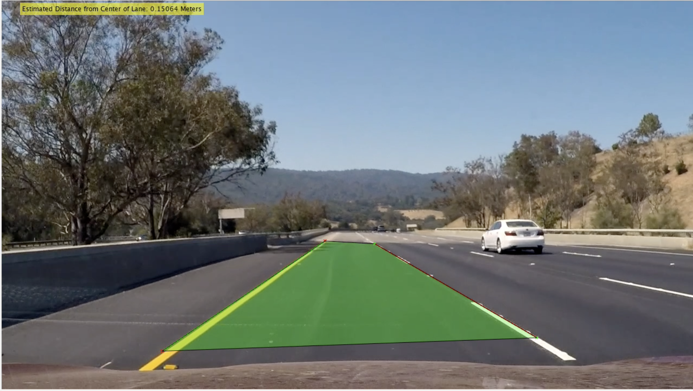
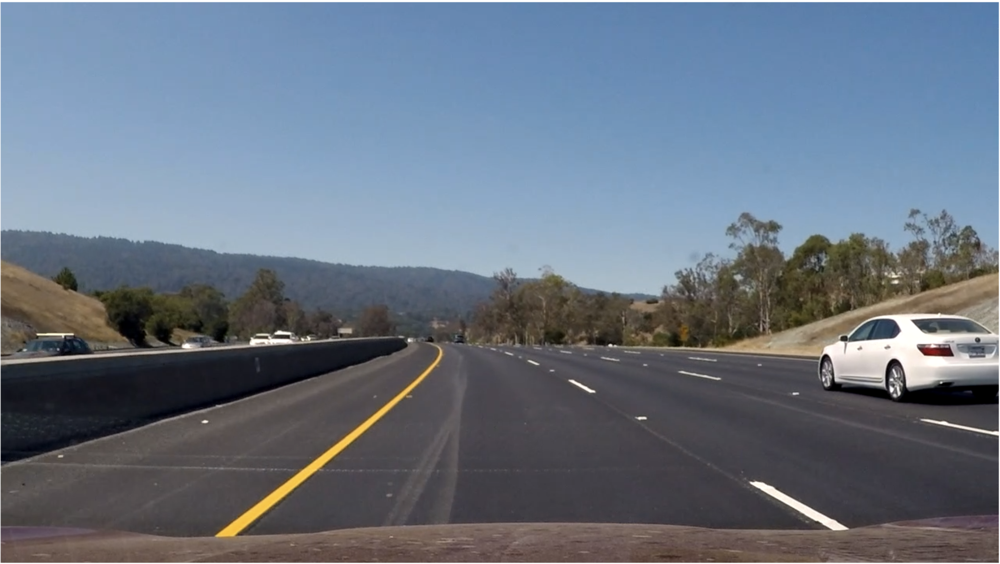
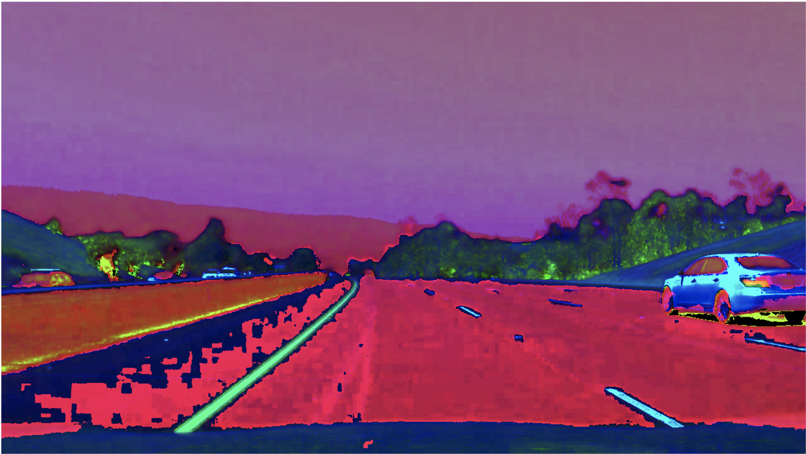
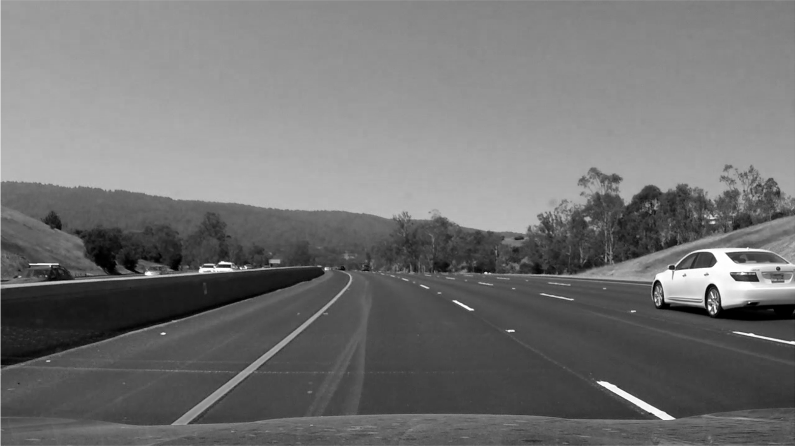
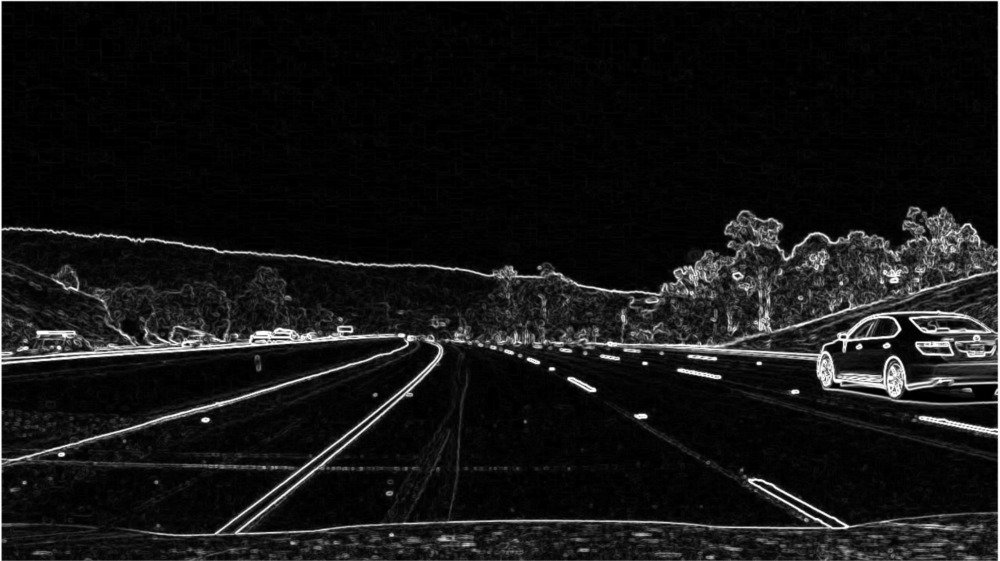
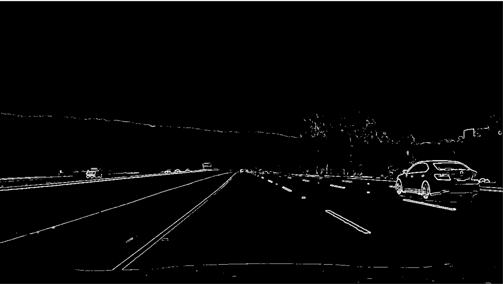
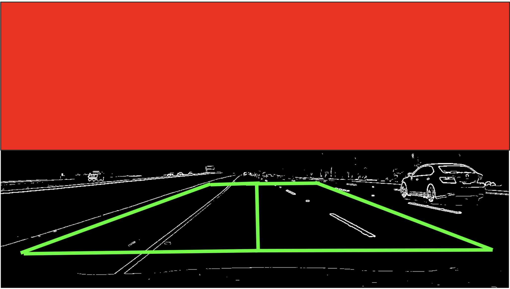
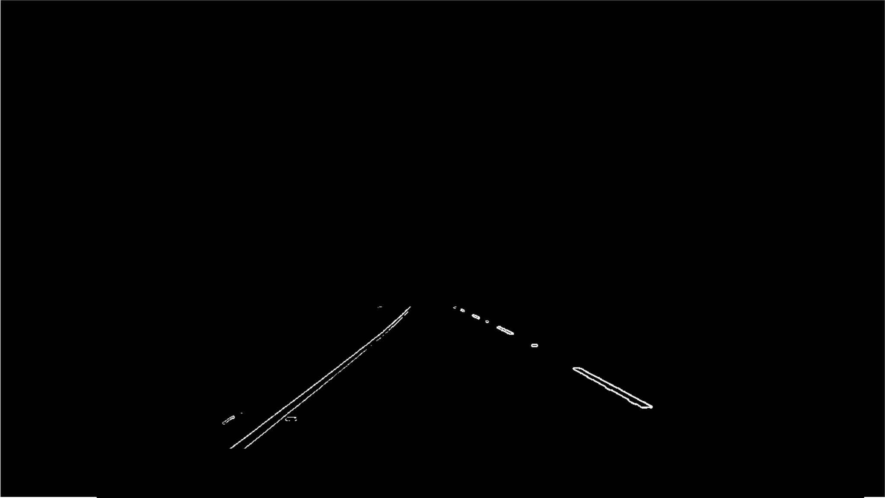
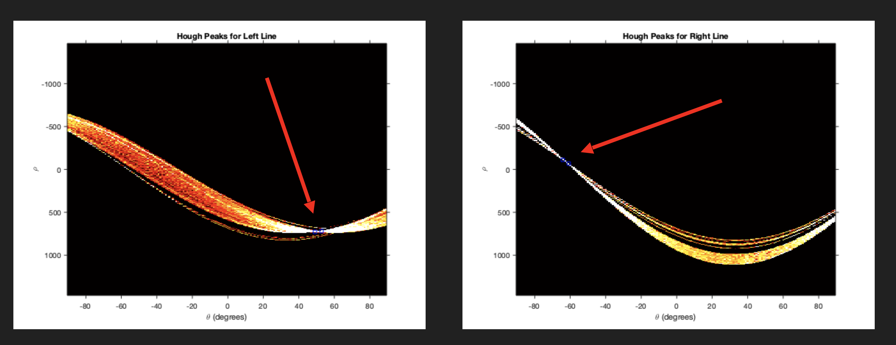

# Lane Detection for self-driving cars / lane-assist written in MATLAB
This is a lane detection pipeline written in matlab.  It takes input from a camera (a video) and finds the driving lane and estimates the offset from center.  It is demonstrated by marking up the videos for human eyes to see ;).

## How to Run:
* To generate a video use the make_vid.m function
	* After the video is done generating you can view it in the Videos directory under the name out_vid.mp4
	* The lane detection will be drawn in red and green lines with alternated point colors, and filled with a translucent green over where the detected lane is.
	* The estimated offset from lane center (using pixel to physical distance scale provided for camera and mount inside car) is displayed in the left corner of the frame.
* To test you can use the script Demonstrate.m and it will run the algorithm on the short testclip from the videos directory

## Example Output

## How does this work?
* This pipeline is run on video inputs.  The dataset I used can be found here: https://github.com/udacity/self-driving-car/tree/master/datasets
* Steps of the pipeline
	* Step 1: Convert image from RGB space to HSL space
		*	RGB Space
		*	
		*	HSL Space
		*	
	* Step 2: Extract the l channel (lightness) from the HSL space
		*	L Channel
		*	
	* Step 3: Perform Sobel–Feldman operator on l channel
		*	Sobel
		*	
	* Step 4: Threshold (binarize) the image
		* 	Thresholded
		*	
	* Step 5: Mask the Image
		*	Masked Image
		*	
		*	
	* Step 6:  Perform Hough Transform on Image
		*	Hough Transform and peaks for left lane and right lane.  When we convert the peaks back into Euclidean space it will be a pair of coordinates representing the lane lines
		*	
		
The results of the steps above is visualized by marking up the found lane region in an image or video (pictured above under Example Output) and also using the pixel difference to convert into physical distance and estiamte an offset of center from the lane.
