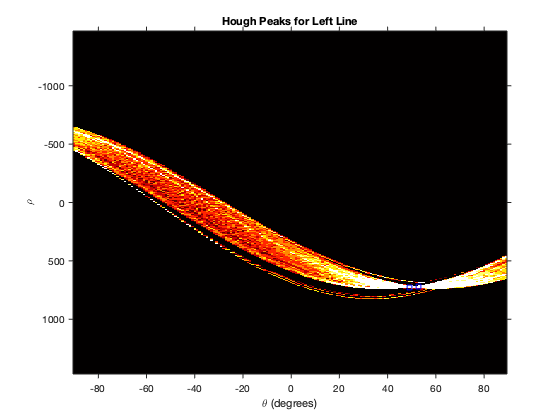
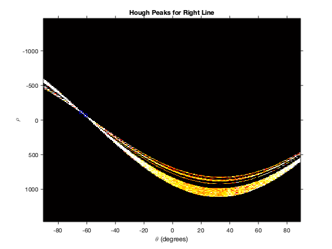
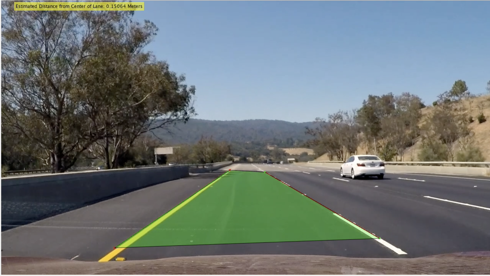

# Simple Lane Detection in MATLAB
This is a simple lane detection pipeline written in MATLAB using Hough transform.  There are functions to demonstrate it working by marking up the frames of the input video from the camera mounted in the car.

## How to Run:
* To generate a video use the make_vid.m function
	* After the video is done generating you can view it in the Videos directory under the name out_vid.mp4
	* The lane detection will be drawn in red and green lines with alternated point colors, and filled with a translucent green over where the detected lane is.
	* The estimated offset from lane center (using pixel to physical distance scale provided for camera and mount inside car) is displayed in the left corner of the frame.
* To test you can use the script Demonstrate.m and it will run the algorithm on the short testclip from the videos directory

## Hough Peaks from Hough Transform (Converting the peaks to Euclidean space gives us the lane lines)

## Example Output

